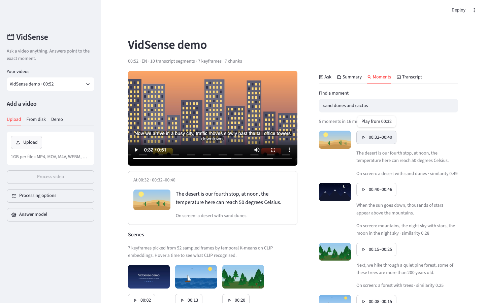
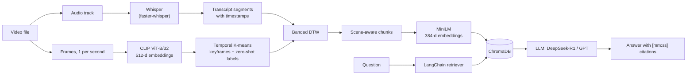

# VidSense

Ask questions about a video and get answers that point to the exact moments. Click a
timestamp and the player jumps there.

VidSense transcribes the audio with **Whisper**, picks keyframes with **CLIP** and
temporal **K-means**, aligns the keyframes to the transcript with **dynamic time
warping**, and indexes the aligned chunks in **ChromaDB**. A **LangChain** pipeline
retrieves the relevant chunks and asks an LLM (**DeepSeek-R1** through Ollama by
default, or an OpenAI model) for an answer with `[mm:ss]` citations. The UI is
**Streamlit**. Everything runs locally; no API key is needed.



## What you can do

- **Ask** anything in plain language. Answers cite `[mm:ss]` moments, and every cited
  moment is a button that moves the player. Follow-up questions use the conversation.
- **Summarize** the whole video into an overview and chapters you can jump to.
- **Find moments** with semantic search over what was said *and* what was on screen,
  without an LLM.
- **Browse** a clickable transcript, captions in the player, and a strip of the
  detected scenes.
- **Measure** retrieval quality, answer accuracy and latency with `vidsense eval`,
  on your own QA set or ActivityNet-QA.

## How it works



1. **Decode.** PyAV (bundled FFmpeg) reads the audio track and samples one frame per second.
2. **Audio.** Whisper (`large-v3-turbo` by default) transcribes with word timestamps, and
   the words are re-cut into sentences, because Whisper's own segments often stop
   mid-sentence. Voice activity detection skips silence, which removes most hallucinated text.
3. **Vision.** CLIP embeds every sampled frame. K-means clusters the frames on
   `[CLIP embedding, scaled timestamp]`, so a scene that comes back later gets its own
   keyframe, then merges neighbouring near-duplicates. CLIP also labels each keyframe
   zero-shot ("a desert with sand dunes") from a vocabulary of 176 scenes, objects and
   activities.
4. **Alignment.** DTW matches keyframes to transcript segments. The cost mixes the time
   gap with CLIP's image-text similarity, so a sentence can shift to the scene it
   describes when narration runs slightly ahead of or behind the picture. A band limits
   the search to pairs within 60 s.
5. **Chunking and retrieval.** The alignment is cut into chunks at scene changes and
   sentence ends. Each chunk's text ("what was said" plus "on screen: …") is embedded
   with MiniLM and stored in a per-video ChromaDB collection.
6. **Answer.** LangChain retrieves the top chunks, rewrites follow-up questions into
   standalone ones, and prompts the LLM to answer only from the excerpts and cite their
   timestamps. DeepSeek-R1's reasoning is kept separate from the answer.

Two embedding spaces are involved, and only one is stored:

| Space | Model | Dimensions | Used for | Stored |
|---|---|---|---|---|
| Image + text | CLIP ViT-B/32 | 512 | picking keyframes, zero-shot labels, frame-sentence similarity in DTW | no, processing only |
| Text | all-MiniLM-L6-v2 | 384 | embedding chunks and questions for retrieval | yes, ChromaDB |

Frames are linked to text through timestamps, not vectors; the CLIP labels are how the
visual side reaches the text index. [docs/ARCHITECTURE.md](docs/ARCHITECTURE.md) covers
each step and the design decisions in detail.

## Quickstart

Requirements: Python 3.10+, macOS or Linux, and about 3 GB of disk for the models.
No system FFmpeg is needed.

```bash
git clone https://github.com/VP-TT/vidsense.git
cd vidsense
uv sync --extra dev          # or: python -m venv .venv && source .venv/bin/activate && pip install -e ".[dev]"
```

Pick a model for the answers (VidSense also works without one: you get the matching
moments instead of a written answer):

```bash
# Local, the default: install Ollama from https://ollama.com (or `brew install ollama`), then
ollama pull deepseek-r1:8b   # ~5 GB; qwen2.5:7b answers faster if you don't need the reasoning

# Or OpenAI
export VIDSENSE_LLM_PROVIDER=openai OPENAI_API_KEY=sk-...
```

Start the app and add a video from the sidebar:

```bash
uv run streamlit run app.py  # or: uv run vidsense ui
```

The sidebar's **Demo** tab generates a one-minute narrated test video on your machine
(macOS `say`, or espeak-ng on Linux) and processes it, which is the quickest way to see
everything working. The first run downloads Whisper, CLIP and MiniLM.

## Command line

```bash
vidsense demo                                  # write demo/vidsense_demo.mp4 and demo/demo_qa.jsonl
vidsense process lecture.mp4 --title "Lecture 3"   # --whisper-model base for a quick run
vidsense list
vidsense search latest "the part about gradient descent"
vidsense ask latest "What does the speaker say about overfitting?" --show-reasoning
vidsense summarize latest
vidsense eval demo/demo_qa.jsonl --answers --judge
vidsense show latest --chunks                  # keyframes, labels, chunks and timings
vidsense delete latest
```

`latest`, an id prefix or a title all work as the video reference. `vidsense <command> --help`
lists every option.

## Configuration

Every setting has a default in [`src/vidsense/config.py`](src/vidsense/config.py) and can be
overridden with an environment variable or a `.env` file (see [`.env.example`](.env.example)).
The ones you are most likely to change:

| Variable | Default | Notes |
|---|---|---|
| `VIDSENSE_WHISPER_MODEL` | `large-v3-turbo` | `base` or `small` are much faster on a CPU |
| `VIDSENSE_LANGUAGE` | auto-detect | e.g. `en` |
| `VIDSENSE_LLM_PROVIDER` | `ollama` | `ollama`, `openai` or `none` |
| `VIDSENSE_LLM_MODEL` | `deepseek-r1:8b` (Ollama), `gpt-4o-mini` (OpenAI) | |
| `OPENAI_BASE_URL` | – | any OpenAI-compatible server: DeepSeek's API, LM Studio, vLLM |
| `VIDSENSE_DTW_SEMANTIC_WEIGHT` | `0.3` | `0` aligns by timestamps only |
| `VIDSENSE_DATA_DIR` | `./data` | indexes, thumbnails and transcripts |

The Streamlit sidebar exposes the processing and answer settings per video.

## Evaluation

`vidsense eval` takes a JSONL file of questions (`video`, `question`, optional `answers`
and gold `start`/`end` seconds) and reports:

- **Retrieval:** hit@1, hit@k and MRR, where a retrieved chunk counts if it overlaps the
  gold time span. Each is shown next to the score a random ranking would get, because
  on a short video with few chunks hit@5 is nearly free.
- **Answers:** contains-match (the normalised reference answer appears in the reply;
  "fifty" matches "50") and, with `--judge`, an LLM judge's yes/no plus a 0–5 score,
  the protocol Video-ChatGPT introduced for open-ended video QA.
- **Latency:** p50 and p95 for retrieval and for full answers.

```bash
vidsense eval demo/demo_qa.jsonl --answers --judge
vidsense eval --activitynet test_q.json test_a.json --video-dir videos/ --limit 500 --answers --judge
```

For ActivityNet-QA, get `test_q.json` and `test_a.json` from
[MILVLG/activitynet-qa](https://github.com/MILVLG/activitynet-qa) and download the
videos yourself (many of the original YouTube videos are no longer available, and the
loader skips questions whose video is missing). Most ActivityNet-QA questions are about
what is *seen* (colours, objects, actions) in videos with little speech, so a system
that reaches the visual side through CLIP labels is at a disadvantage there; it is a
good stress test of that part of the design.

Results on the bundled synthetic demo (10 questions on a 52-second video, default
models), a smoke test of the whole pipeline rather than a benchmark:

| Metric | VidSense | Random ranking |
|---|---|---|
| hit@1 | 0.90 | 0.17 |
| hit@5 | 1.00 | 0.83 |
| MRR | 0.95 | – |

The one miss: "How many places does the tour visit?" ranked the "That is the end of our
tour" chunk above the introduction, which came second.

## Performance

Measured on an Apple M1 Pro (16 GB): Whisper on the CPU with int8 weights (CTranslate2
has no Apple GPU backend), CLIP on the GPU through PyTorch MPS.

| Step | Time |
|---|---|
| Process the 52 s demo, Whisper `large-v3-turbo` | 23 s (transcription 14.7 s, about 0.3x real time) |
| Process the 52 s demo, Whisper `base` | 14 s (transcription 4.0 s) |
| Search (embed the question + ChromaDB query) | p50 13 ms, p95 31 ms |
| Answer, `deepseek-r1:1.5b` | p50 8.1 s |
| DTW, one-hour video (500 keyframes x 1,000 segments) | 0.11 s full table, 0.02 s with the 60 s band |
| DTW, four-hour video (2,000 x 4,000) | 1.9 s full table, 0.27 s with the band |

Models were already downloaded; CLIP loading accounts for most of the vision branch,
which runs in parallel with transcription. The banded DTW path had the same cost as the
full one in every run of `python scripts/bench_dtw.py`. Transcription, not alignment, is
the slow step on long videos. Answer time depends mostly on the LLM: run `vidsense eval
--answers` with your model to measure it.

## Project layout

```
app.py                     Streamlit entry point (the UI lives in src/vidsense/app.py)
src/vidsense/
  media.py                 decoding, frame sampling, audio extraction (PyAV)
  transcribe.py            Whisper via faster-whisper
  vision.py                CLIP encoder and zero-shot tagging
  keyframes.py             temporal K-means, duplicate merging, coverage metric
  align.py                 banded DTW and scene-aware chunking
  embed.py, store.py       MiniLM embeddings; ChromaDB and the on-disk video library
  pipeline.py              orchestration: audio and vision in parallel, then align and index
  retrieval.py, qa.py      search, the LangChain retriever, answers with citations
  summarize.py             map-reduce summaries with chapters
  llm.py                   Ollama / OpenAI models, reasoning handling, citation parsing
  evaluate.py              the evaluation harness
  jobs.py, app.py          background processing and the Streamlit UI
  demo.py                  synthetic narrated demo video with ground-truth questions
  resources/visual_concepts.txt   the zero-shot label vocabulary
scripts/bench_dtw.py       DTW full-vs-banded benchmark
tests/                     unit tests, UI smoke tests, and an end-to-end test (pytest -m slow)
```

Run the tests with `uv run pytest` (about 15 s); `uv run pytest -m slow` processes a
generated video with real models.

## Troubleshooting

- **"Ollama isn't running"**: start the Ollama app or run `ollama serve`, then
  `ollama pull deepseek-r1:8b`. Until then, answers fall back to the matching moments.
- **The first video takes a while**: the first run downloads Whisper (`large-v3-turbo`
  is 1.6 GB), CLIP (600 MB) and MiniLM (90 MB). After that everything loads from the
  local cache and works offline. For a quick first try, set `VIDSENSE_WHISPER_MODEL=base`.
- **A video doesn't play in the app**: browsers can't play MKV or AVI. Convert to MP4;
  search and answers work either way.
- **Answers are slow**: DeepSeek-R1 reasons before it answers. `VIDSENSE_LLM_MODEL=qwen2.5:7b`
  (after `ollama pull qwen2.5:7b`) answers several times faster.

## Limitations

- **Vision reaches answers only through CLIP labels**, which come from a fixed
  vocabulary. A question about something that was shown but never said, and isn't in the
  label list ("what colour is the car?"), can't be answered. Captioning keyframes
  (BLIP-2, Florence-2) or sending them to a multimodal LLM would close that gap.
- **Timestamps are segment-level** (Whisper's accuracy is around half a second), and the
  Streamlit player seeks to whole seconds.
- **Single-user and local:** one processing worker, data on disk. Serving many users
  would mean a task queue for processing, object storage for videos, and a server-side
  vector store with a namespace per user.
- **English-first defaults:** Whisper handles many languages, but MiniLM is an English
  model; switch `VIDSENSE_EMBED_MODEL` to `paraphrase-multilingual-MiniLM-L12-v2` for
  other languages.
