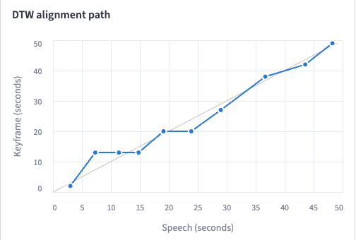

# VidSense architecture

This document explains how a video becomes a searchable index, how questions are
answered, and why each piece was chosen. File names refer to `src/vidsense/`.

## 1. Data flow

```
video file
 ├─ audio ──▶ Whisper ──▶ sentences (start, end, text)                transcript.json, transcript.vtt
 └─ frames (1 fps) ──▶ CLIP ──▶ temporal K-means ──▶ keyframes + tags  keyframes.json, keyframes/*.jpg
                                        │
             sentences + keyframes ──▶ banded DTW ──▶ alignment path    alignment.json
                                        │
                          scene-aware chunking ──▶ chunks              chunks.json
                                        │
                           MiniLM (384-d) ──▶ ChromaDB collection "vidsense_<video id>"
```

`pipeline.process_video` runs the audio and vision branches in two threads, because
they don't depend on each other until alignment: Whisper runs on the CPU (CTranslate2
has no Apple GPU backend) while CLIP runs on the GPU. The video id is a SHA-256 of the
file, so processing the same file again returns the existing index immediately.
`manifest.json` is written last, with `status: ready`, so a crash never leaves a
half-built index that looks finished.

## 2. Decoding (`media.py`)

PyAV wraps FFmpeg's libraries and ships them in its wheel, so there is no system
FFmpeg to install. Frames are decoded sequentially with frame threading and only the
sampled ones are converted to RGB, at 256 px on the short side (CLIP needs 224). Phone
videos are rotated upright using the frame's display matrix. Audio is resampled to
16 kHz mono float32, which is what Whisper expects.

Sampling is 1 frame per second, capped at 1,800 frames: longer videos are sampled more
sparsely rather than using more memory or time.

## 3. Transcription (`transcribe.py`)

[faster-whisper](https://github.com/SYSTRAN/faster-whisper) runs the original Whisper
weights through CTranslate2, about four times faster than the reference
implementation, with int8 weights on the CPU. The default model is `large-v3-turbo`:
large-v3's encoder with 4 decoder layers instead of 32, which makes decoding several
times faster for a small accuracy cost. `large-v3` is the choice when accuracy matters
more than time, and the only one of the two trained for translation (`--translate`).

Voice activity detection (Silero VAD, bundled) skips silence and music before decoding.
That removes most of Whisper's best-known failure, hallucinated text such as "Thanks for
watching" over silent stretches.

**Sentences, not Whisper segments.** Whisper's segments are decoding windows: on the
demo, `large-v3-turbo` ended one at "...five very different places around" and started
the next with "the world. Our first stop is the open ocean." Segments like that straddle
scene changes, and the chunker (which never splits a sentence) then merged five scenes
into one chunk. VidSense asks for word timestamps and re-cuts the words into sentences
at sentence-final punctuation, at pauses over 1.5 s, or after 20 s of unpunctuated
speech. On the demo that took the default model from 2 chunks to 6 scene-aligned ones.

Why Whisper over wav2vec 2.0, DeepSpeech or a hosted API: it is open source, robust
to accents and noise without fine-tuning, multilingual, and returns segment timestamps,
which the alignment needs.

## 4. Keyframes (`vision.py`, `keyframes.py`)

CLIP is a dual encoder: a ViT for images and a Transformer for text, trained
contrastively so that an image and its caption land close together in one 512-d space.
Two properties make it the right tool here, and the reason it was chosen over BLIP-2,
ViLBERT or ImageBind: frame embeddings that capture meaning rather than pixels, and a
shared image-text space that allows zero-shot labelling and frame-sentence comparison
without any training.

**Temporal K-means.** Each sampled frame becomes

```
[ CLIP embedding (unit length, 512-d) , w · t / T ]
```

with `T = duration / K` the expected length of one cluster and `w = 0.3`. Plain
K-means on the embeddings merges a scene with its later reappearance (the speaker
returns after a slide) into one cluster with one keyframe, which breaks alignment
because DTW needs keyframes in time order. The time term keeps clusters contiguous: two
visually identical frames ten minutes apart are far apart in feature space.

`K = duration / 5 s` (capped at 300) deliberately over-segments. Each cluster's medoid,
the real frame nearest the centroid, becomes a keyframe, and consecutive keyframes with
cosine similarity ≥ 0.95 are merged. A two-minute static shot therefore ends up as one
keyframe, while every real scene change survives.

**Coverage.** For every sampled frame, the best cosine similarity to any keyframe is
measured. "Keyframes cover X % of sampled frames at cosine ≥ 0.9, using Y % of them"
is a measurable version of "information retention". On the demo it is 100 % with
13 % of the frames.

**Zero-shot labels.** Each keyframe is compared with `"a photo of {label}."` and
`"a video frame showing {label}."` for each of 176 labels (`resources/visual_concepts.txt`;
averaging two templates is the standard CLIP prompt-ensembling trick). A softmax over
CLIP's scaled similarities gives probabilities; the top three above 0.10 are kept, and
an ambiguous frame gets no labels rather than wrong ones. These labels are how the
visual side reaches the text index.

## 5. Alignment (`align.py`)

DTW finds the lowest-cost monotonic matching between the keyframe sequence and the
segment sequence: every keyframe matched to at least one segment, every segment to at
least one keyframe, never going back in time. That guarantee is why DTW is used rather
than bucketing segments by timestamp. The cost of matching keyframe *i* with segment *j* is

```
cost(i, j) = (1 − w) · gap(i, j) / 10 s  +  w · mismatch(i, j)          w = 0.3
```

- `gap` is the distance from the middle of the segment to the keyframe's time span, 0
  if it falls inside. Using the midpoint means a sentence that straddles a cut goes to
  the scene it mostly belongs to.
- `mismatch` compares the CLIP similarity between the keyframe and the sentence with
  that sentence's best-matching keyframe; a shortfall of 0.1 cosine or more counts as a
  full mismatch. A fixed scale, rather than rescaling each sentence to [0, 1], stops
  CLIP noise on generic sentences ("around the world.") from moving them.



Each dot pairs a transcript sentence (x) with the keyframe it was matched to (y); the
grey diagonal is perfect sync. Horizontal runs are several sentences sharing one scene.

With these numbers a sentence can move to a neighbouring keyframe it clearly describes,
by up to about `10 s · w / (1 − w) ≈ 4 s`, which covers narration that runs slightly
ahead of or behind the picture. Setting `w = 0` gives a purely timestamp-based alignment.

**The band.** DTW fills an n × m table. A Sakoe-Chiba band normally limits the search
to a diagonal strip; here neither sequence is evenly spaced in time, so the band is
measured in seconds: only pairs within 60 s are evaluated. If the band can't connect
the start to the end (a long silence), full DTW runs instead. `scripts/bench_dtw.py`:

| Video | Table | Full | 60 s band | Same optimum |
|---|---|---|---|---|
| 1 hour, 500 keyframes × 1,000 segments | 500 k cells | 0.11 s | 17.6 k cells, 0.02 s | yes |
| 4 hours, 2,000 × 4,000 | 8 M cells | 1.9 s | 71 k cells, 0.27 s | yes |

Alignment runs on sentences, not words, which keeps the table small; transcription is
what takes time on long videos.

## 6. Chunking (`align.py: build_chunks`)

The chunk is the unit that gets embedded and retrieved. Walking the sentences in order,
a chunk closes when:

- the next sentence would push it past 900 characters or 45 seconds;
- there is a pause longer than 8 s; or
- the scene changes (the next sentence's best-matching keyframe on the DTW path differs
  from the one the chunk started in) and the chunk already lasts 5 s, so fast cuts don't
  produce one-line chunks.

Because the transcript units are whole sentences, a chunk never ends mid-sentence. (If
word timestamps are unavailable, VidSense falls back to Whisper's segments and a scene
cut waits for sentence-final punctuation instead.)

Chunks with almost no text ("Okay.") are folded into a neighbour. A chunk keeps the
keyframes DTW matched to it that were on screen for at least 2 s (or a quarter of the
chunk). Keyframes left in no chunk, such as scenes during a long silence, become
visual-only chunks so they remain searchable through their labels. The embedded text is
what was said plus `On screen: <labels>`.

## 7. Retrieval (`embed.py`, `store.py`, `retrieval.py`)

Chunks and questions are embedded with `all-MiniLM-L6-v2` (384-d), normalised so
cosine similarity is a dot product, and stored in ChromaDB with an HNSW cosine index.
Queries use the embedding model recorded in the video's manifest, so changing the
default never mixes two vector spaces.

**Why ChromaDB.** It runs embedded in the process with on-disk persistence, stores
metadata and documents next to the vectors, and needs no server. FAISS is a fast index
library but leaves persistence and metadata to you; Pinecone and other hosted stores add
a network hop, an account and cost, which a local tool doesn't need. Each video gets its
own collection: deleting or re-indexing a video never touches another, and a query can
only return chunks from the video being asked about. With several users the same idea
becomes a namespace per user.

**Why MiniLM.** It is small (22 M parameters), fast on a CPU (a few milliseconds per
query), and trained on sentence pairs, which suits chunk-sized text. On the demo a search
takes p50 7 ms, p95 9 ms.

## 8. Answers (`qa.py`, `llm.py`)

LangChain is the orchestration layer, not a hosting platform: `VideoRetriever` is a
LangChain `BaseRetriever` over ChromaDB, the prompts are `ChatPromptTemplate`s, and
`prompt | model` is an LCEL chain, so swapping DeepSeek-R1 on Ollama for an OpenAI model
is a settings change.

1. **Follow-ups.** With chat history, the model first rewrites the question into a
   standalone one ("how old are they?" → "how old are the trees in the forest?"), and
   retrieval uses the rewritten question.
2. **Retrieval.** The top 5 chunks, shown to the model in time order with their time
   ranges, what was said, and what was on screen (flagged as automatic labels).
3. **Prompt.** Answer only from the excerpts, say so when the answer isn't there, and
   cite `[mm:ss]` after each claim.
4. **Reasoning models.** DeepSeek-R1 thinks before answering. When Ollama reports the
   `thinking` capability, VidSense asks for the reasoning in a separate field; servers
   that inline it as `<think>…</think>` are handled by a streaming splitter that copes with
   tags cut across chunks. The reasoning is shown folded away in the UI and never reaches
   the answer or the citations.
5. **Citations.** Timestamps in brackets are parsed from the answer; bare ones count
   when they fall inside a retrieved excerpt (small models often drop the brackets);
   timestamps past the end of the video are discarded. Each becomes a jump button.

Without an LLM (provider `none`, or Ollama not running), the same flow returns the
best-matching moments instead of prose.

## 9. Summaries (`summarize.py`)

Retrieval reads a handful of chunks, which is right for questions and wrong for a
summary. A summary reads the whole timestamped transcript in one prompt when it fits
the model's context window (set explicitly to 8,192 tokens for Ollama, so long prompts
aren't silently truncated). Otherwise it uses map-reduce: each part becomes timestamped notes, and the
notes become an overview plus chapters. The parser tolerates the format drift small
models produce, and results are cached per model.

## 10. UI (`app.py`, `jobs.py`)

Processing runs on a worker thread owned by the Streamlit server, so it survives clicks
and page refreshes; the page polls progress once a second. Streamlit re-runs the script
on every interaction and re-reads the video file whenever the player is drawn, so the
Ask, Summary, Moments and Transcript tabs are fragments that re-run on their own; only
a jump re-runs the page. The player seeks to whole seconds, so jumps round to the
nearest second, about Whisper's own timestamp accuracy.

## 11. Evaluation (`evaluate.py`)

- **Retrieval:** hit@1, hit@k and MRR. A retrieved chunk is relevant if it overlaps the
  gold span by at least 1 s (or half the chunk); touching it at a boundary doesn't
  count. Every score is reported next to a random ranking's, which matters on short
  videos: on the 7-chunk demo, a random top 5 contains a relevant chunk 76 % of the time.
- **Answers:** contains-match after normalisation (number words to digits, articles
  removed; yes/no answers must lead the reply), plus an optional LLM judge returning
  yes/no and a 0–5 score, the Video-ChatGPT protocol used by most published
  ActivityNet-QA numbers. A judge from the same model family as the answerer is lenient
  toward it; for reported numbers, use a different, stronger judge model.
- **Latency:** p50/p95 after a warm-up query, so model loading isn't counted as search time.

## 12. Scaling to many users

The local design maps onto a service without changing the pipeline:

- **Processing** moves to a task queue (Celery, RQ or a cloud queue) with GPU workers;
  the UI submits a job and polls its status, exactly as `jobs.py` does in-process.
- **Videos and artifacts** move to object storage, keyed by content hash, so duplicate
  uploads are free.
- **Vectors** move to a server-side store (Chroma server, pgvector, Qdrant, Pinecone)
  with a namespace or metadata filter per user and video.
- **LLM calls** go to a shared inference server (vLLM, Ollama on a GPU host, or an API),
  which is the main per-question cost.

## 13. Known limitations

- The visual side is reduced to CLIP labels from a fixed vocabulary, so questions about
  something shown but never said, and not in the vocabulary, can't be answered.
  Captioning keyframes or a multimodal LLM over the retrieved keyframes would fix that.
- Alignment and jumps are segment-level; word timestamps would make them finer.
- Retrieval is dense only; adding BM25 (hybrid search) and a cross-encoder re-ranker
  would help exact names and rare terms.
- MiniLM is English-focused; multilingual videos need a multilingual embedding model.
